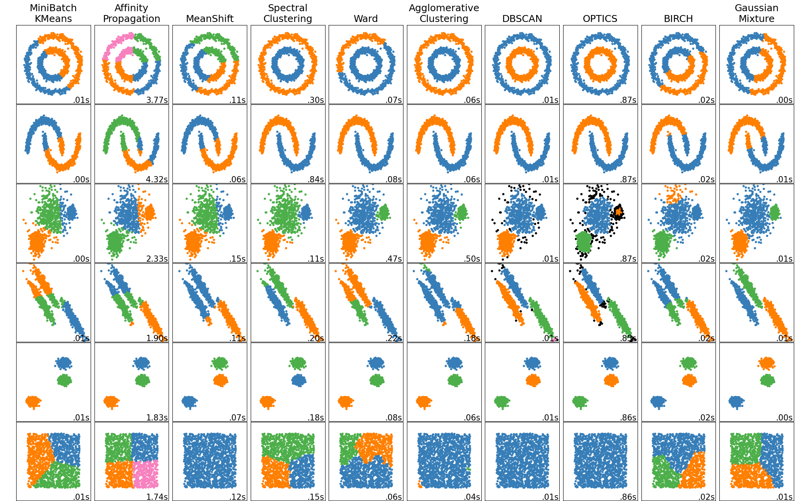

## 前言

创建时间：`2022-1-5 10:30:44`

最近更新时间：`2022-1-26 11:01:54`

一些补充内容将由链接的形式发出；


## 基本概念

`2022-1-5 10:30:44`

主要内容：

- 概念（让机器按照设定的算法思路，对数据进行迭代计算，使得模型输出逼近目标输出的一种技巧）
- 原理目标（通过设计合理的 Loss 函数，通过最优化的方法使其最小化）
- 一般流程（问题和目标定位；确定 Loss 函数；模型选择；优化器选择；数据处理；特征工程；模型拟合；模型评估；交叉检验；超参数调优；）
- 模型分类（有监督/无监督/半监督；回归预测/分类/聚类/降维/异常检验...；）
- 数据处理（缺失值；one-hot；分箱；归一化；Normalize；...）
- 特征工程（非线性转换；删除小方差；逐步筛选法；主成分分析；因子分析；SVD分解；...）
- 损失函数（Cross-Entropy；MSE；...）
- 损失函数的正则化（L1、L2、L1+L2）
- 训练优化技巧（Dropout；LearningRate；SGD；...）
- 模型集成方法（Bagging、Boosting、Stacking....）
- 评价指标（分类：Confusion-Matrix / F1-Score/...；预测：MSE / MAE / R2/...；)
- 调参技巧（格栅搜索/...；）
- 其他分支（深度学习/迁移学习/强化学习/...）
- 常见模型
  - 回归预测（多元线性回归；Ridge回归；保序回归；...）
  - 分类模型（逻辑回归；决策树；SVM；神经网络；...）
  - 聚类模型（K-Means；DBSCAN；层次凝聚法；分裂分裂法；Two-Step；...）
  - 时间序列（趋势分解；移动平滑；AR；MA；ARMA；ARIMA；...）
  - 集成算法（Adaboost；RandomForest；GBDT；Xgboost；...）
  - 神经网络（MLP；CNN；RNN；GAN；LSTM；...）
  - 贝叶斯模型（概率图；...）
  - 降维（PCA；FA；SVD；...）
- 其他概念
  - multi class & multi task（多分类模型：1个输出变量（可以多个值）；多任务模型：k个输出变量；）


## 特征工程

`2022-1-5 12:31:58`

数据和特征决定了机器学习的上限，而模型和算法只是逼近这个上限。


#### 数据处理

`2022-1-5 16:16:32`

取自 `sklearn.preprocessing`

- Binarizer：二值化，通过设定阈值，将样本转化成为 0 或 1；
- FunctionTransformer：函数转化；
- KBinsDiscretizer：分箱；
- KernelCenterer：核矩阵；
- LabelBinarizer：Label 二值化；（ n 个变量，0 or 1）
- LabelEncoder：Label 编码；（1个变量，0 ~ k-1）
- MaxAbsScaler：通过 abs(max) 进行规模化；
- `MinMaxScaler`：`归一化`；（数值规约在 0 - 1之间）
- MultiLabelBinarizer；多级标签的 Label 二值化
- `Normalizer`：`正则化`（这个翻译就很奇葩，正态化？规范化？）
  - 直觉上就是在 axis=1 的方向上将数据规约到 0-1之间
  - 每个样本内部的元素除以该样本的范数
  - L1正则化；$x_{ij}= x_{ij} / \sum(x_i)$ ；比如样本 $[[10,4,5,2], [1,4,5,7]]，a[0][0]=10/(10+4+5+2)=0.476$ 
  - L2正则化；$x_{ij}= x_{ij} / \sqrt{\sum(x_i^2)}$ ；比如样本 $[[10,4,5,2], [1,4,5,7]]，a[0][0]=10/\sqrt{(10^2+4^2+5^2+2^2)}=0.830$ 
- OneHotEncoder：0-1编码；
- OrdinalEncoder：顺序编码；
  - 编码后结果为 $ [ [0,1], [2, 1] ]$，表示第1个样本的两个特征编号为 0 和 1，第2个样本的两个特征编号为 2 和 1；
- PolynomialFeatures：生成多项式和交互特征；
- PowerTransformer：通过幂次变换，让数据分布向着高斯分布的方向转化（好像和 Box-Cox 以及 Yeo-Johnson 转换有关联）
- QuantileTransformer：通过百分位数信息，将数据转化为均匀分布或者正态分布
- RobustScaler：鲁棒性规划化，通过统计信息对异常点进行处理，有良好的鲁棒性；
- `StandardScaler`：`标准化`（去中心，去方差）


#### 特征抽取

`2022-1-24 13:43:20`

https://scikit-learn.org/stable/modules/classes.html#module-sklearn.feature_extraction.image

- extract_patches_2d（将一个 $(n,n,3)$ 的大图片，拆成 $(k,k,m,3)$ 的小图片，m 表示个数）


#### 特征选择

`2022-1-24 08:54:56`


## 常见算法和模型

`2022-1-5 11:07:49`

模型：多种算法组成的数据处理框架（Logistic = one-hot + PCA + SGD + Loss + Matric）

如果说算法是砖，那模型就是由砖块搭好的房子


#### 矩阵分解

`2022-1-5 12:33:20`

- PCA（主成分分析）
  - 求解特征根和特征向量需要用到方阵，所以先求解样本矩阵 $X$ 的协差矩阵 $E_{(m,m)} = X^TX$
  - 沿着 $E$ 中方差最大的方向，获取前 $k$ 个特征根和特征向量，特征向量组成投影矩阵 $W$
  - $X_{pca} = X*W^T$
- FA（因子分析）
  - 采用 $k$ 个隐变量的组合方式来表示原本的 $m$ 个特征，即从特征群里面抽取公共因子
  - 另外还分为：EFA（探索性因子分析）；CFA（验证性因子分析）
- LDA（线性判别降维）
  - https://www.cnblogs.com/pinard/p/6244265.html
  - LDA 是一种应用在分类模型上的有监督的降维算法，目标是投影后类内方差最小，类间方差最大
  - 中间涉及瑞利商（Rayleigh quotient）和广义瑞利商（genralized Rayleigh quotient）两个概念；
  - 算法流程：
    - 1、计算类内散度矩阵 $S_w$ ；
    - 2、计算类间散度矩阵 $S_b$ ；
    - 3、计算 $S_w^{-1}S_b$ ；
    - 4、计算 $S_w^{-1}S_b$ 的 k 阶特征投影矩阵 $W$；
    - 5、降维获取新样本 $z = W^T · x$
  - 降维聚焦与均值的时候 LDA 效果好，聚焦于方差时 PCA 效果好
- SVD（奇异值分解）
  - PCA 用样本矩阵 $X$ 的协差矩阵 $E=X^TX$ 来获取特征向量和特征根；
  - SVD 采用 $XX^T_{(n,n)}$ 和  $X^TX_{(m,m)}$ 和 进行计算，最终分解得到 $U$ 和 $V$ 左右两个矩阵
  - $X = U \Sigma V^T$ ，其中阶数分别为 $(n,m) = (n,d)*(d,k)*(k,m)$
  - $d$ 和 $k$ 是可以控制的特征数量，数值越大 $U$ 和 $V$ 对 $X$ 的表达精度越高
  - $U$ 是 $X$ 降维出来的左矩阵，$V$ 是 $X$ 降维出来的右矩阵，在实际应用中有不同的特点
    - 假设 $X$ 是 $n$ 个消费者在 $m$ 个商品中的偏好数值
    - $X$ 降维出来的 $U$ 则表示 $n$ 个消费者在 $d$ 个商品群组中的偏好综合值（对列，对特征数量的压缩）
    - $X$ 降维出来的 $V$ 则表示 $k$ 个消费群体对 $m$ 个商品中的偏好综合值（对行，对样本数量的压缩）
  - SVD 计算 V 的过程中涉及到  $X^TX_{(m,m)}$  ，当样本和特征的数量太大的时候需要极大的空间来保存这个协差矩阵，SVD 的一些实现算法好像可以有其他方法求解这个东西，避免直接进行暴力求解特征根（但是什么算法实现的还没查到）
  - 可以看出 PCA 其实就是 SVD 的左矩阵 U，sklearn 的 PCA 实际上调用的也是 SVD 计算的过程
  - https://www.cnblogs.com/long5683/p/13142126.html
- ICA（独立成分分析）
  - ICA又称盲源分离(Blind source separation, BSS)
  - 假设有一组样本 $X$，知道它其实由一组信号源 $S$ 生成，$S$ 的分量之间是互相独立的，求解 $A$ 和 $S$，令 $X = A·S$
  - 大多数 ICA 的求解算法，都是先通过 PCA 将 $X$ 降维成为 $Y$，再标准化为 $Z$，通过 $Z$ 估计求解 $A$ 和 $S$
  - FastICA，先找出 $w_1$，令 $E[(W^TX)]^4$ 最大，然后不断获取正交的 $w_2 .... w_k$
  - 如果多于一个特征具有高斯性质（正态分布），ICA 的解不唯一；如果特征都是非高斯性的，ICA 的解是唯一的；
  - PCA 是对数据降维，ICA 更准确地表述是在分离数据源（解混，顺带降维）;
  - PCA 大多数是ICA的预处理部分，也就是ICA的白化部分；
  - PCA 正交，是因为两个正交向量所表示的信息是完全不相关的，所以这两个向量将会表示更多的信息。
  - ICA 不是不要求呈高斯分布，而是高斯分布（正态分布）独立性最不好，负熵最大（ICA 根据负熵最小来进行迭代处理，所以高斯分布没必要用 ICA 处理）；
  - ICA是解混，用矩阵理解就是找到最大线性无关组，表示所有向量，和PCA不是一个东西。

- LU 分解
  - 将一个方阵 $A$ ，转换成下三角矩阵 L 和上三角矩阵 U 的乘积；$A = L·U$；
  - 一般用来求解线性方程、求反矩阵、计算行列式；
  - 通过高斯消元法，令 $L_2 L_1 L_0 A = U$，经过整理便得到 $A = LU$
  - 其中 $Li$ 表示一个行列交换的近零矩阵，$L$ 为其乘积的倒数，$U$ 表示消元后的上三角矩阵；
- LUP 分解
  - https://zhuanlan.zhihu.com/p/84210687
  - 在 LU 分解的基础上，每一步的高斯消元法，添加行置换操作 P（Pivoting），将数值最大的元素放到上面
  - 比 LU 分解要稳定；
  - $L_2 P_2 · L_1 P_1 · L_0 P_0· A = U$ ； 
  - $PA = LU$；
- Cholesky 分解
  - LU 分解的一种特殊情况，当 A 是 SPD 矩阵（对称正定矩阵），可得 $U = L^T$

- 谱分解
  - （这个谱似乎指的就是特征值，看了一点关于知乎上的内容，求解过程和PCA差不多，应该是一个东西）
- LR 分解（满秩分解）
  - 矩阵 $A$ 不是满轶的，所以才需要进行满秩分解。
  - 满秩分解，需要将矩阵 $A$ 进行初等行变换，将其化简为 Hermite 型
  - 矩阵 $A$，通过化简成为 Hermite 型的矩阵 $B$，其中 R 为 B 的非零行组成的矩阵
  - $A = L · R$
  - Hermite标准型矩阵是：非零行的第一个元素必须为1
- QR 分解
  - 前提条件是可逆矩阵存在（满秩）
  - 通过施密特正交化，将矩阵分成正交矩阵 Q 和三角矩阵 R；
- 关于矩阵分解的参考文章
  - https://zhuanlan.zhihu.com/p/52890135（知乎，科学摆渡人，《矩阵分解》）


#### 回归模型

`2022-1-5 12:33:35`

- Linear（线性回归）；
  - 分别为每一个特征赋予一个权重，采用最小二乘法或牛顿迭代法令MSE最小化

- Nonlinear（非线性回归）；
  - 将具有非线性的特征，转换成为线性特征再拟合；
  - 包括但不限于：指数、对数、幂次转换；

- Lasso、Ridge、Elastic-Net（套索回归，岭回归，弹力网）；
  - 在 Loss 函数中，分别加入 L1、L2、L1+L2，令 W 的每个分量尽量向 0 压缩，以达到消除共线性和保留显著特征的效果；

- Polynominal（多项式回归）；
  - 将整个模型通过2次项，3次项展开，将单一特征转换成为高纬度的复合特征；
  - 这个概念和`拉格朗日插值法`有些关联，n 个样本点能被 n-1 次项的多项式完全拟合；

- Percentage（百分比回归）；
- Isotonic （保序回归）；
  - 对某片区域的自变量，拟合结果为其均值；
  - 如在药剂量和生理指标的研究上，某段区间的指标应该排除个体差异性，用均值替代；
- Logistic（逻辑回归）；
  - 通过 Sigmoid 函数，将输出值规约到 $[0,1]$ 的范围；
  - Sigmoid 函数在求导的时候，对 0.5 左右的数值最敏感，对 0 - 1 的数值不敏感
  - 在分类模型中，这样的性质体现出在模型对分类效果不好的样本点有格外注重的性质；
- OMP（正交匹配追踪，Orthogonal Matching Pursuit）
- BR（贝叶斯回归，Bayesian Ridge）
  - https://www.cnblogs.com/pinard/p/6026343.html
  - 贝叶斯回归模型假设先验概率，似然函数和后验概率都是正态分布。先验概率是假设模型输出Y是符合均值为Xθ的正态分布，正则化参数α被看作是一个需要从数据中估计得到的随机变量。回归系数θ的先验分布规律为球形正态分布，超参数为λ。我们需要通过最大化边际似然函数来估计超参数α和λ，以及回归系数θ。
  - 此处对损失函数即负的最大化边际似然函数不多讨论，不过其形式和Ridge回归的损失函数很像，所以也取名BayesianRidge。
- ARD（自动关联确定，Automatic Relevance Determination）
  - https://www.jianshu.com/p/7b42de56c72b
  - ARDRegression和BayesianRidge很像，唯一的区别在于对回归系数θ的先验分布假设。BayesianRidge假设θ的先验分布规律为球形正态分布，而ARDRegression丢掉BayesianRidge中的球形高斯的假设，采用与坐标轴平行的椭圆形高斯分布。这样对应的超参数λ有n个维度，各不相同。而上面的BayesianRidge中球形分布的θ对应的λ只有一个。
  - ARDRegression也是通过最大化边际似然函数来估计超参数α和λ向量，以及回归系数θ。
- 广义线性回归
- 前项选择法（Forward Selection）
  - f 逐步筛选的一种方法；
  - https://blog.csdn.net/zhouzhouasishuijiao/article/details/85603096
  - 一种贪心算法

- 前项梯度法（Forward Stepwise）
- LARS（最小角回归法，Least Angle Regression）
  - https://blog.csdn.net/u014664226/article/details/52240272/
  - 最小角回归是一种对 L1 正则项优化计算的方法（还有另一种是 坐标下降法）
  - 逐步筛选法（Forward Selection）和 Lasso 都可以看做是其变体；
  - 


#### 树模型

`2022-1-5 14:26:00`

- CT（Classification-Tree，分类树）
  - ID3 算法：采用了信息增益的方法，局限性在于多值的特征信息增益特别大（极端情况下类似身份证这样的特征信息熵会是0）
  - C4.5 算法：采用信息增益率的方法，缓解了 ID3 的问题。
- CART（Classification-And-Regression-Tree，分类回归树）
  - C4.5 算法：采用遍历的方式，将连续型的特征二分，获取最佳分裂点
- RF（Random-Forest，随机森林）
  - 多个决策树并行组成的模型群，训练用的样本和特征带有随机性；
  - 结果是每棵树输出的平均；
- GBDT（Gradient-Boosting-Decision-Tree，梯度提升树）
  - 多个决策树串行组成的模型组合，下一棵树训练的样本，是上一棵树的残差；
  - 结果是每棵树输出的和；
- Xgboost（eXtreme-Gradient-Boostings，极端梯度提升树）
  - https://zhuanlan.zhihu.com/p/83901304
  - Xgboost 是 GBDT 的一个工程实现；
  - 将 k 个模型的复杂度之和 Omiga ，加入到损失函数中作为正则项，防止模型过拟合；
  - GBDT只使用了一阶导数信息，XGBoost对代价函数进行二阶泰勒展开，可以同时使用一阶和二阶导数。
  - GBDT在每轮迭代时使用全部的数据，XGBoost则采用了与随机森林相似的策略，支持对数据进行采样。
  - GBDT没有设计对缺失值进行处理，XGBoost能够自动学习出缺失值的处理策略。
  - XGBoost 基于预排序方法，构建决策树的算法基本思想是：首先对所有特征都按照特征值的数值进行预排序。其次在遍历分割点的时候用O(#data)的代价找到一个特征上的最好分割点。（这就造成了需要2倍的空间来保存原来的特征和排序后的特征 [ 用于后续快速计算分割点 ]；计算消耗大；cache 无法优化；）
- LightGBM（Light-Gradient-Boosting，轻量梯度提升树）
  - https://zhuanlan.zhihu.com/p/99069186
  - LightGBM是一个实现GBDT算法的框架，支持高效率的并行训练，并且具有更快的训练速度、更低的内存消耗、更好的准确率、支持分布式可以快速处理海量数据等优点。
  - 基于`Histogram` 的决策树算法，还用直方图的`作差运算`来加速训练。
  - 单边梯度采样 `Gradient-based One-Side Sampling(GOSS)`：使用GOSS可以减少大量只具有小梯度的数据实例，这样在计算信息增益的时候只利用剩下的具有高梯度的数据就可以了，相比XGBoost遍历所有特征值节省了不少时间和空间上的开销。
  - 互斥特征捆绑 `Exclusive Feature Bundling(EFB)`：使用EFB可以将许多互斥的特征绑定为一个特征，这样达到了降维的目的。(EFB 采用图的方式来捆绑特征；特征捆绑的表示方式，假设 A 的直方图 bins 为 [ 0,10 )，B 为 [ 0,20 )，则 C = [ 0, 30 )，前10 个 bins 为 A，后面 20 个为 B； )
  - 带深度限制的 `Leaf-wise` 的叶子生长策略：大多数GBDT工具使用低效的按层生长 (`level-wise`) 的决策树生长策略，因为它不加区分的对待同一层的叶子，带来了很多没必要的开销。实际上很多叶子的分裂增益较低，没必要进行搜索和分裂。LightGBM使用了带有深度限制的按叶子生长 (leaf-wise) 算法。
  - 直接支持类别特征(Categorical Feature)
  - 支持高效并行
  - Cache命中率优化
- CatGBM（Categorical-Features-Gradient-Boosting，类别型梯度提升树）
  - https://www.cnblogs.com/lvdongjie/p/11391245.html
  - 对于高势特征（不适合one-hot的多值特征），采用目标变量的值统计进行分组（TS，Target Statistic），通过设置阈值，找到二分法中最优分裂点（LightGBM以损失部分信息为代价将所有的长尾类别归位一类）
  - 
- HyperGBM
  - 国产开源工具HyperGBM，自动对（Catboost+LightGBM+XGBoost）三个模型做超参数优化然后Ensemble，而且包括前面的数据预处理和特征变化，就是所谓的全Pipeline优化，比如连续型的特征如何做缺失值填充、如何做归一化，类别型的怎么做encoding，前面的数据管道不同后面模型的超参数也需要有相应的变化。
  - https://github.com/DataCanvasIO/HyperGBM


#### 风控模型

- WOE
- IV


#### 异常值检测

- 箱型图
- 孤立森林


#### 聚类模型

`2022-1-8 11:23:08`

https://scikit-learn.org/stable/modules/clustering.html

- K-Means（K-均值）
  - 基于样本点和聚类中心间距离的聚类算法
- K-means++
  - 在选取初始聚类中心时，假设已经 n 个初始聚类中心，则在选取第 n+1 个聚类中心时，距离当前 n 个聚类中心越远的点会有更高的概率被选为第 n+1 个聚类中心。
- ISODATA （动态聚类）
  - Iterative Selforganizing Data Analysis Techniques Algorithm（迭代自组织数据分析算法）
  - 基于 Kmeans 的聚类方法，带有合并和分裂两个操作
  - 当属于某个类别的样本数过少时，把该类别去除；当属于某个类别的样本数过多、分散程度较大时，把该类别分为两个子类别）
- Mean Shift（均值漂移）
  - 基于核密度估计的爬山算法，可用于聚类、图像分割、跟踪等；
  - 定义一个半径 r ，所有半径内的样本向量之和为圆心的漂移方向和距离，直到稳定或停止迭代；
- Affinity Propagation（AP，亲和力传播）
  - 一种基于样本之间相互距离的聚类算法
  - 需要维护一个 `n*n` 大小的距离矩阵图，只适用于小样本的数据集合；
- Ward Hierarchical clustering（层次聚类，划分法，基于离差平方和）
  - 度量距离的八种方法：（最短距离SIN、最长距离COM、中心距理法MED、重心法SEM、类平均法AVE、可变类平均法、离差平方和法WARD、可变方法）https://blog.csdn.net/leemusk/article/details/106128079
  - 适用于（特征多，样本量大）的情况；
- Agglomerative Clustering（层次聚类，凝聚法）
- Spectral Clustering（谱聚类）
  - 一种基于样本之间距离的聚类方法，对配对距离矩阵 pairwise_matrix 进行 laplacian 变换（降维）后再进行聚类的方法
  - 适用于（特征少，样本量适中）的情况；
- DBSCAN
  - Density-Based Spatial Clustering of Applications with Noise，应用于噪声点的基于密度的空间聚类方法
  - 一种基于密度的聚类方法
  - $\epsilon$ 邻域；邻域内最小样本数 min_samples；核心对象 p；密度可达对象 q；密度相连对象 o；....；
  - 确定扫描半径 eps 和最小样本数 minPts；随机初始点；半径内大于 minPts 则形成簇，并标记出发点为 Visited；递归直到所有点都被 Visited；
  - DBSCAN 每次运算的结果都会一样；
- OPTICS
  - Ordering Point To Idenfy the Cluster Stuctrue，确定群集结构的排序点
  - 一种基于密度的聚类方法；DBSCAN的改进，对输入参数不敏感；
  - OPTICS 不显式生成数据类别，而是对样本进行排序编号，以便对样本进一步聚类；
  - https://blog.csdn.net/itplus/article/details/10089323
- BIRCH
  - Balanced Iterative Reducing and Clustering using Hierarchies，平衡迭代缩减和基于层次的聚类
  - 包括概念：聚类特征(Clustering Feature, CF)、聚类特征树(CF Tree)
  - 自底向上；有效处理离群点；基于距离；
- Two-Step Clustering（两步聚类）
  - BIRCH 的改进；
  - 预聚类；贯序方法；读入样本并入子类或者独立新类；L个子类合并成 L' 个新子类；
  - http://www.datasoldier.net/archives/665
  - https://zhuanlan.zhihu.com/p/150792273
- Gaussian Mixture（GMM，高斯混合模型）
  - 一种使用 EM 算法的模型；每个样本点都会被分配到各个 class 的概率；


- 聚类效果（图）




#### 关联规则

`2022-1-24 11:41:21`

关联规则常用来作为零售行业中的商品组合促销提供数据支持，最经典的案例莫过于啤酒与尿布的故事，其计算方法非常简单，常用的三个指标有：支持度（support）、置信度（confidence）、提升度（lift）。但其中难点在于怎么处理以千万为数量的订单中，数十万商品之间的频繁项挖掘，而挖掘频繁项的方法主要有：

- Apriori
- FP-Tree


#### 时间序列

`2022-1-7 09:14:02`

一种将过去 m 期数值作为自变量的回归模型。

- 趋势分解（长期趋势 T 、季节变动 S 、周期变动 C 、随机变动 I）
  - 乘法模型：$T·S·C·I$
  - 加法模型：$T+S+C+I$
  - 简单平均法（简单平均法；加权平均法；局部回归法；）
  - 趋势拟合（线性拟合；非线性拟合；）
  - 平滑法（移动平滑；指数平滑；）
- 平稳时间序列
  - 差分法；
  - 白噪声检验（Ljung – Box 检验；）
  - 平稳性检验（单位根检验；）
  - 相关变量图 （自相关 ACF ；偏相关 PCAF；）
  - 信息准则（赤池信息准则 AIC 、贝叶斯信息准则 BIC；）
- AR （p 阶自回归模型）
  - 条件： $u_{t} = \epsilon_{t}$ （累计扰动 = 当期扰动）是白噪声；
  - 函数：$Y_{t} = a_{1}·Y_{t-1}+a_{2}·Y_{t-2}+...+a_{p}·Y_{t-p}+\epsilon_{t}$
  - 场景：一个作家在12月工资日的收入，可能和11月、10月、9月发表的文章数量有关，而且这几个月的文章收入会随着时间递减，直到三个月后基本就没有了热度收入降到零，并且作家每个月的发挥都很稳定，没有其他影响（ $\epsilon_{t}$ 白噪声）
- MA（q 阶移动平均模型）
  - 条件：扰动 $u_{t}$ 不是白噪声，受到之前扰动的影响；
  - 函数：$u_{t} = \epsilon_{t} - c_{1}·\epsilon_{t-1}+c_{2}·\epsilon_{t-2}-...-c_{q}·\epsilon_{t-q}$
- ARMA（AR + MA，移动平均自回归模型）
  - $\begin{flalign}
    Y_{t}
    & = AR(p)+MA(q) & 
    \\
    & = (a_{1}·Y_{t-1}+a_{2}·Y_{t-2}+...+a_{p}·Y_{t-p})+(u_{t}) & 
    \\
    & = (a_{1}·Y_{t-1}+a_{2}·Y_{t-2}+...+a_{p}·Y_{t-p})+(\epsilon_{t} - c_{1}·\epsilon_{t-1}+c_{2}·\epsilon_{t-2}-...-c_{q}·\epsilon_{t-q}) & \\
    \end{flalign}$
- ARIMA（Autoregressive Integrated Moving Average model，差分整合的移动平均自回归模型）
  - ARIMA ( p，d，q )，d 为使之成为平稳序列所做的差分次数（阶数）
  - $\begin{flalign}
    & (1-\sum_{i=1}^{p}a_{i}L^{i})(1-L)^{d}Y_{t} = (1+\sum_{i=1}^{q}c_{i}L^{i})\epsilon_{t} &
    \end{flalign}$
  - $L^{i}$ 为滞后算子
- VAR（向量自回归模型）
  - AR 在向量维度上的推广；用来估计联合内生变量的动态关系，而不带有任何事先约束条件；


#### 神经网络

`2022-1-5 12:33:52`

- Perceptron（ 感知机）；
- Multi-Layer-Perceptron（MLP，多层感知机）；
- Radial-Basis-Natwork（RBF，径向基神经网络）；
  - 径向基函数是一个取值仅仅依赖于离原点距离的实值函数，也就是 Φ(x）=Φ(‖x‖)；可以简单理解为增加了一个激活函数，专门用来处理数据的转化，通过另一种更合适的数值来表达样本之间的关系。常用的径向基函数包括：Gaussian、Sigmoid 等；
  - 一个简单的例子（MLP 将神经元从 Perceptron 改成 Logistic ，便是一个 Sigmoid 为激活函数的 RBF 神经网络）
- CNN（卷积神经网络）
  - 所谓卷积是在 `k*k` 方块上用同一组权重参数遍历激活的操作，令网络模型记住像素之间空间信息的一种技巧。通过叠加多层通道，可以完成多个图像特征的抽取和识别。
- RNN（循环神经网络）
  - 简单来说就是在当前神经层中 `{ t-1时刻的输出样本，t 时刻的输入样本 }` 拼凑在一起，成为一个 `k + n`  长度的新样本，再输入到模型当中继续训练的技巧。这样操作等同于模型不但接受了当前时刻的输入信息，还记住了前一时刻的输出信息（当前内容 + 过去经验），产生了时间前后上的神奇联系。
- LSTM（长短时间记忆单元）
  - 在普通RNN的神经元上增加处理逻辑，神经元内部增加（输入门、遗忘门、输出门）三个不同的函数处理规则，使得模型自适应地决定该保留多少过去的经验，当前输入应该注重哪个分量，输出应该保持哪些内容等，看起来很玄乎，但理解后挺有意思
- GRU（Gate Recurrent Unit，门循环单元）；
  - 和 LSTM 一样，是 RNN 上的一个变体，原理和效果也相近。LSTM 使用三个门来控制，GRU 则用一个门来完成遗忘和选择，相比较下更易计算；当 LSTM 训练不出来时，可用 GRU 替代。
- DNN
- Hofielol


- 神经网络（图）


#### 集成模型

`2022-1-15 10:26:03`

- Voting
  - 对基础模型的输出进行投票，分为 soft 和 hard 两种投票方式；
  - soft 按照最大输出值投出分类下标，hard 按照投票多寡投出分类众数
  
- Stacking
  - 对k个基础模型的输出值进行拟合
  - 一般输出函数采用 Logistic Regression
  
- Bagging
  - 基估计器作用于样本的随机子集；
  - k 个基础模型的输出均值作为最终输出；
  - 原理在于引入随机化能减少黑盒方法的方差；
  - paste：样本的随机子集；
  - Bagging：样本的互相置换；
  - Random Subspace：特征的随机子集；
  - Random Patches：特征和样本的随机子集；
  
- Blending

  - > Blending是一种模型融合方法，对于一般的blending，主要思路是把原始的训练集先分成两部分，比如70%的数据作为训练集，剩下30%的数据作为测试集。第一轮训练: 我们在这70%的数据上训练多个模型，然后去预测那30%测试数据的label。第二轮训练，我们就直接用第一轮训练的模型在这30%数据上的预测结果做为新特征继续训练。

  - 用训练集拟合多个模型（m1，m2，，，mk）

  - 用测试集获取多个特征（F1，F2，，，Fk），训练得到一个新模型 L1

  - 用验证集获取结果，得到 $L_1((m_1，m_2，，，m_k)(x)) => L_1(F_1，F_2，，，F_k) => y$

  - 与 Stacking 的区别在于，Stacking 没有对样本进行划分

- Random Forest
  
  - 每棵树的样本和特征都是随机的；
  - 但是分裂选择最佳分裂点；
  
- Extra-Trees
  - Extremely randomized trees，极端随机树
  - 类似 Random Forest；
  - 每棵树都是全部样本；分叉完全随机；
  - 参考（https://blog.csdn.net/xbmatrix/article/details/69488867）；
  
- Adaboost
  - 先对随机 m1个样本训练第1个弱分类器，`错误的样本` 和 `新m2个样本` 训练第2个弱分类器，直到第k个弱分类器；
  - 最后k个分类器组成最终1个强分类器；
  - 按照效果强弱对k个弱分类器赋予权重；
  - 最终结果由加权结果得出；
  - 关于推广到多标签任务的 SAMME 和 SAMME.R 算法参考（https://blog.csdn.net/weixin_43298886/article/details/110927084）；
  - SAMME 对每个分类错误的标签赋予一个值 $\frac{-1}{k-1}$ ；
  - SAMME.R 在 SAMME 的基础上，增加了加权概率估计的方法来更新公式；
  - Adaboost 采用的是指数损失函数；
  
- GBDT

- Xgboost

- LigntGBM

- CatGBM

- IsoForest


#### 贝叶斯模型

`2022-1-5 12:33:43`

贝叶斯推断是一种“逆概”问题，通过结果推断原事件的概率；

概率密度函数 & 似然函数，也是类似的关系；


概念

- 先验概率：$P(Y|X)$ ，知道原因，求结果的概率（喝凉水，拉肚子的概率是5%）
- 后验概率：$P(X|Y)$ ，知道结果，求原因的概率（拉肚子，喝凉水引起的概率是20%）
- 条件概率：$P(A|B) = \frac{P(AB)}{P(B)}$
- 全概率公式：$P(B) = \sum_{i=1}^{n} P(A_{i})P(B|A_{i})$
- 贝叶斯概率：$P(A_i|B) = \frac{P(A_i)P(B|A_i)}{\sum_{j=1}^{n}P(A_j)P(B|A_j)}$ （后验概率，可以从完备的先验概率事件中求得）


`2022-1-19 16:30:23`

模型：

- NB（朴素贝叶斯，Naive Bayes）


- BN（贝叶斯网络，Bayesian Network）
  
  - 有向无环图（DAG）；变量不独立；只表示相关，不表示因果；
  
  - 某个事件发生的联合概率分布 $p(x_1, x_2, ..., x_n) = \prod_{i=1}^{n} p(x_i|parents(x_i))$
  
  - 一个简单的概率图模型；
  
  - 
  
    
  
  - CPD（条件概率分布，conditional probability distribution）
  
  - CPT（条件概率表）


- DBN（动态贝叶斯网络，Dynamic Bayesian Network）
  - http://blog.sina.com.cn/s/blog_13dd6d82a0102vclu.html
  - 沿时间轴变化的 BN 即构成 DBN；网络结构不会随着时间变化；观测样本会随着时间变化；


- SEM（结构方程模型，Structural Equation Models）

  - https://zhuanlan.zhihu.com/p/138837728
  - https://www.jianshu.com/p/ac673b719c74
  - https://zhuanlan.zhihu.com/p/262903408
  - 融合了因子分析（Factor Analysis）、方差分析（如ANOVA, ANCOVA, MANOVA, MANCOVA）、多重回归（multiple regression）等多重模型；
  
    


#### 马尔可夫模型

`2022-1-20 14:20:52`

https://www.cnblogs.com/mantch/p/11203748.html

当几个变量之间不是互相独立的，两点之间连接在一起，则形成了一个`网络`；当这个网络是有向无环图，则称为`贝叶斯网络`；当这个图退化称为`线性链`的形式，称为`马尔科夫过程（马尔可夫链，马尔可夫模型）`；如果是无向图，则称为`马尔可夫网络（马尔可夫随机场）`；如果在给定的条件下研究，则称为`马尔可夫条件随机场`；当马尔科夫随机场的拓扑结构转换成线性的，则称为`线性条件随机场`。


- MC （马尔可夫链，Markov Chain）

  - （似乎也称为：Markov-Model（MM，马尔可夫模型））
  - https://zhuanlan.zhihu.com/p/38764470/
  - 假设某一时刻状态转移的概率只依赖于它的前一个状态；这样做可以大大简化模型的复杂度；
  - $P(X_{t+1}|X_{t}) = P(X_{t+1}|X_{t},...,X_{2},X_{1})$
  - $P(X_{t},...,X_{2},X_{1}) = P(X_{t}|X_{t-1})···P(X_{2}|X_{1})P(X_{1}) = P(X_1)\prod_{i=2}^{t}P(X_{i}|X_{i-1})$
  - 只要能求出系统中任意两个状态之间的转换概率，马尔科夫链的模型就能确定下来了
  
    
  
  - 从上面可以看出来，更像是个状态转移矩阵（状态转移函数）
  
    

  - 对于任意初始概率分布 $V$ ，均有 $VP^n = V_{c}$ ，通过 $P$ 的不断迭代，结果会趋向于某个稳定的概率分布；
  - $\pi P = \pi $ ，称 $\pi$ 为 $P$ 的平稳分布（详细内容还需要继续理解，简单认为 $P$ 自己不断迭代后的稳定结果）
  - 基于马尔可夫链的采样：
    - 状态转移矩阵 $P$；转移次数 $n_1$；样本采样数 $n_2$；
    - 随意初始概率 $x_0$；
    - 将 $P$ 迭代 $n_1$ 次；
    - 从 $P(x_{n_1} |x_{n_1-1} ) $中获取概率分布 $x_{n_1}$，由这个概率分布来选择1个样本；
    - 再迭代 $n_2$ 次，获取 $n_2$ 个样本


- Hidden-Markov-Model（HMM，隐马尔科夫模型）
  - 观测序列其实收到另外一个隐含序列的影响和控制；
  - $P(E_t) = P(E_t|X_t) = P(E_t|P(X_t|X_{t-1}))$
  - https://zhuanlan.zhihu.com/p/25703302（序列的算法（一·a）隐马尔可夫模型）
  
    
  
    


- MN（马尔可夫网络，Markov Network）
  - 无向无环图；
  - Markov Random Field（MRF，马尔可夫随机场）
  - https://zhuanlan.zhihu.com/p/102014899
  - 贝叶斯网络：结点与结点之间是以有向箭头相连接，代表是这个结点会影响下一个结点。
  - 马尔可夫网络：结点与结点之间是以无向箭头相连接，代表是结点与结点之间会相互影响。

  - 随机场：当给场中每一个`位置`中按照某种随机分布赋予`相空间`的一个值后，场中的全体即是随机场。（假设有 $(n,n)$ 大小的矩阵，每个位置都按照概率分布，随机赋予实数域 $R$ 中的某个值，这边是随机场）
  - 马尔可夫随机场：满足马尔可夫特性的随机场（每个位置的随机值，只和上一次的值有关）


- Conditional-Random-Field（CRF，条件随机场）
  - https://zhuanlan.zhihu.com/p/104562658《如何轻松愉快地理解条件随机场（CRF）？》
  - 条件随机场的应用例子：
    - 对一张小明张开了嘴的照片进行分类（吃饭、唱歌、加油），需要用到时间序列的信息的前提条件；
    - 对一段话的单词进行词性标注（名词，动词，xx，介词，名词），标注第3个单词需要用到前后单词的词性；动词后面跟动词，打负分；
  - 特征函数
    - $f_j (s,i,l_i,l_{i-1})$
    - 表示第 i 个单词的词性标注得分；
    - $i$ 表示第 i 个单词，$l_i$ 表示第 i 个单词的词性，$s$ 表示句子，$f$ 表示词性标注评分；
  - 特征函数集
    - $score(l|s) = \sum_{i=1}^{m}\sum_{j=1}^{n}\lambda_j f_j (s,i,l_i,l_{i-1})$
    - $i$ 表示第 i 个单词，$l_i$ 表示第 $i$ 个单词的词性，$s$ 表示句子，$f$ 表示词性标注评分，$\lambda$ 表示特征函数 $f$ 对应被赋予的权重；
    - $score$ 表示整个句子的词性标注情况，用 n 个特征函数来综合评价一个单词 i 的评分情况；用 1 个句子中的 m 个单词来评价整个句子的评价情况；
  - 概率
    - $p(l|s) = \frac{exp(score)}{\sum_{}^{}exp(score)}$
    - 条件随机场是逻辑回归的序列化版本
    - 逻辑回归是用于分类的对数线性模型
    - 条件随机场是用于序列化标注的对数线性模型。
  - CRF比HMM要强大的多
    - 它可以解决所有HMM能够解决的问题，并且还可以解决许多HMM解决不了的问题。
    - CRF可以定义数量更多，种类更丰富的特征函数
    - CRF可以使用任意的权重


#### 强化学习

- Q-Learning


#### 图形学算法

- C 空间法
- 自由空间法
- 栅格法（grid）
- voronoi 图


#### 仿生学算法

`2022-1-17 16:54:27`

- 神经网络
  - 模拟人类大脑神经，通过节点表示状态，通过神经元之间的联系作为信息传递介质；
  - 神经网络衍生出一大堆不同结构和激活形式的分支，如：RBF、CNN、RNN、DNN、GAN 等，详细看神经网络章节；
- 模拟退火算法（Simulated Annealing，SA）
  - 一种通过系统能量函数 $E$ 和随机值进行比较，决定是否跳出局部最优值的方式
  - 基本思想借鉴了模拟锻造过程中的退火情况（能量衰减）；
  - 设置初始温度、降温率等参数，通过迭代次数的增加，减少系统整体的能量；
  - 通过系统能量大小，与随机值进行比较，决定是否跳出当前局部最优解；
- 蚁群算法
  - 模仿蚂蚁寻找路径的方法
  - 前期迭代的蚂蚁随机选择方向，在经过的路径上留下信息素
  - 后面的蚂蚁根据不同道路的信息素浓度，按照概率分布的大小选择方向；
  - 信息素的浓度、挥发效率、蚂蚁随机方向的概率大小等因素，会对结果和迭代次数产生比较大的影响；
  - 结果不是全局最优，只能达到相对理想的次优解。
- 遗传算法
  - 按照生物繁殖的过程，将一群目标解的值当成族群
  - 经过（淘汰、繁衍、变异）的不断迭代，得到能接受的次优解；
  - 直观理解
    - 一群候选项中，通过环境淘汰（适应性函数）只剩下部分可接受解；
    - 可接受的解之间通过转译成二进制数字，两两配对交换相同位置上的bite，产生一个后代二进制数字
    - 一定程度上可以理解为，后代遗传到父母两个解的优点，当然也有可能遗传到的是缺点；
    - 通过随机性对某个bite位发生变化，达到基因变异的效果。
  - 优点，可以跳出局部最优解，但想达到全局最优还是很困难；
  - 缺点，二进制的数值表达对离散性质的问题比较友好，碰上连续值的求解问题精度损失很厉害；
- 鱼群算法
- 粒子群算法
- 人工势场法 
  - 一种虚拟力法，模仿 `引力` 和 `斥力` 下的物体运动
  - 目标点和运动体间为引力，运动体和障碍物间为斥力
  - 通过建立引力场斥力场函数进行路径寻优。
  - 优点是规划出来的路径平滑安全、描述简单等
  - 但是存在局部最优的问题
  - 引力场的设计是算法能否成功应用的关键。
- 模糊逻辑算法
  - 模拟驾驶员的驾驶经验，将生理上的感知和动作结合起来
  - 根据系统实时的传感器信息，通过`查表`得到规划信息，从而实现路径规划。
  - 算法符合人类思维习惯，免去数学建模，也便于将专家知识转换为控制信号，具有很好的一致性、稳定性和连续性。
  - 但总结模糊规则比较困难，而且一旦确定模糊规则在线调整困难，应变性差。
  - 最优的隶属度函数、控制规则及在线调整方法是最大难题。
- 禁忌搜索算法（TS）
  - 一种全局逐步寻优算法，是对人类智力过程的一种模拟。
  - 通过引入一个灵活的存储结构和相应的晋级规则，来避免与会搜索，
  - 并通过藐视准则来赦免一些被紧急的优良状态，以实现全局优化。
- A*算法（A Star）
  - 一种静态路网中求解最短路径最有效的直接搜索方法，也是解决许多搜索问题的有效算法。
  - 算法中的距离估算值与实际值越接近，最终搜索速度越快。
  - 衍生：ALT，CH，HL


#### 计算机传统算法

- 递归
- 递推
- 动态规划
- 回溯法
- 分支限界
- 广度优先搜索
- 深度优先搜索


#### 排序算法

- 冒泡排序
- 快速排序
- 桶排序


## 应用领域

`2022-1-24 08:59:36`

- 自然语言处理（NLP）
- 语音识别（AMS）
- 计算机视觉
- 零售业
  - 推荐引擎
  - 销售目标预测
  - 路径规划
  - 物流排车
  - 库存优化管理


## 评估指标

`2022-1-10 11:34:23`


#### 预测效果

`2022-1-18 09:22:44`

- R2
- MSE
- MAE
- RMSE


#### 分类效果

`2022-1-18 09:23:26`

- confuse_matrix
- accuracy
- f1_score
- ROC
- AUC


#### 聚类效果

`2022-1-10 11:34:30`

- Rand Index（兰德指数）
- Normalized Mutual Information (NMI，互信息)
- Adjusted Mutual Information (AMI，调整的互信息)
- Fowlkes-Mallows scores（FMI）
- Silhouette Coefficient（轮廓系数）
- Calinski-Harabasz Index
- Davies-Bouldin Index
- Contingency Matrix


## 损失函数

`2022-1-5 09:41:32`

损失函数：用于衡量当前模型输出值和目标值差距的一种函数;

参考了一些博文，以及 keras 和 sklearn 上的文档，整理了部分常用的损失函数。


**0-1损失：**

- zero_one（0-1 损失）
- zero_one2（宽松 0-1 损失）

**感知机：**

- perceptron（感知机损失）

**铰链损失：**

- hinge（铰链损失）
- squared_hinge（Hinge 平方损失）
- categorical_hinge（分类的 Hinge 损失）

**三角函数：**

- consin（夹角余弦）
- logcosh（双曲余弦对数）

**交叉熵：**

- cross_entropy（交叉熵）
- categorical_crossentropy
- sparse_categorical_crossentropy
- binary_crossentropy
- kullback_leibler_divergence（KLD，相对熵）

**误差类：**

- mean_squared_error（MSE，均方误差）
- mean_squared_logarithmic_error（MSLE，均方对数误差）
- mean_absolute_error（MAE，绝对误差）
- mean_absolute_percentage_error（MAPE，绝对百分比误差）

**汉明损失：**

- hamming_loss（汉明损失）


## 优化器

`2022-1-5 15:57:47`

机器学习过程中，遭遇算法迭代速度比较慢的时候，需要用到优化器来加速训练过程，一般伴随着精度降低的代价。

sklearn 中的叫法是 solver，tensorflow 中的叫法是 optimizer，两个应该是一回事。


#### 坐标下降法

`2022-1-25 17:12:41`

梯度下降法需要用到可微的性质，对一些不能求导的情况（如 Lasso），可以采用坐标下降法；


#### 梯度下降

`2022-1-7 11:32:19`

- GD（梯度下降，Gradient Descent）
  - 也称 FGD（快速下降法，Fast Gradient Descent）
  - 每次输入一个样本，更新所有的 $W$
- BGD（批量梯度下降，Batch Gradient Descent）
  - 每次输入所有样本，更新所有的 $W$
- MBGD（小批量梯度下降，Mini-Batch Gradient Descent）
  - 每次输入 k 个样本，更新所有的 $W$
- SGD（随机梯度下降，Stochastic Gradient Descent）
  - 加入了 min-batch，每次输入1个或者 k 个样本，随机更新 $W$ 的单一方向分量 $w_i$
  - `随机：指的是随机一个维度（即随机一个方向，随机一个变量）,假设在一个地平面上，GD 可以自由选择周围 360°的某个最优的精确方向，SGD 每次只能选择东南西北四个方向，走起路来歪歪扭扭像个醉鬼，但神奇的是前进方向在大体上是正确的，而且还能避开一些局部最小值（高级陷阱困住的往往都是聪明人）`
  - 因为加入了 min-batch，所以计算量比 BGD 要小，但是因为每次都只更新其中1个方向，所以迭代的次数会增加。
  - 精度理论上会比 GD 要低，但因为可能避开局部最小值，结果更好一些。
- SAG（随机平均梯度下降，Stochastic Average Gradient）
  - 保存每一层迭代过程中，n 个样本，m 个维度的梯度信息到矩阵 $W$
  - 迭代到第 k 轮，更新单个样本 i，随机方向 j 上的梯度信息 $w_{i,j}^{k}$
  - $w_{i,j}^{k+1} = w_{i,j}^{k} - a_{k} · \frac{1}{n} \sum_{i=1}^{n} W_{ij}$
  - 然后 $w_{i,j}^{k+1}$ 保存到 $W_{i,j}$
  - 直观上理解，就是在 SGD 每次任由单个样本肆意走动的基础上，吸取之前整个群体行走的经验，综合考虑。
- SAGA（SAG加速）
  - $w_{i,j}^{k+1} = w_{i,j}^{k} - a_{k} (W_{ij} - W_{i[j]} + \frac{1}{n} \sum_{i=1}^{n} W_{i[j]}) $ 
  - $W_{i[j]}$ 是上一次更新到样本 i 中维度 j 的数值。
  - 直观上就是更新量 $g_{k}$ 中增加了 $(W_{ij} - W_{i[j]})$ 这个修正量，对比 SAG 又加深了个人经验的比重
  - 还有说 SAGA 是无偏估计，而 SAG 是有偏的，粗略看了一遍还没来得及加深理解；
- SVRG（随机方差缩减梯度下降，stochastic variance reduced gradient）
  - 通过缩减方差上界，来达到线性收敛效果的优化方法。
  - https://blog.csdn.net/sun_shengyun/article/details/53811882
  - https://zhuanlan.zhihu.com/p/51184012
- <a>2022-0105-1714-《SGD，SAG 、SVRG 等梯度下降优化器之间的关系》（待补充）</a>


#### 牛顿法

`2022-1-6 15:55:24`

Newton methond

- 牛顿法（求根）
  - 通过求导（切线）确定步长大小，不断迭代来求得根解的方法。
  - $$x_{k} = x_{k-1} - \frac{f(x_{k-1})}{f'(x_{k-1})}$$
- 牛顿法（求驻点）
  - 等同于求导函数的根解（本质上是二阶泰勒展开式）
  - $$x_{k} = x_{k-1} - \frac{f'(x_{k-1})}{f''(x_{k-1})}$$
- 牛顿法（多元函数求驻点）
  - 对一个向量 x 求偏导，$f(x)$ 是个标量，$f'(x)$ 是个向量，$f''(x)$ 是个矩阵（Hessian Matrix）
  - $$x_{k} = x_{k-1} - \frac{f'(x_{k-1})}{f''(x_{k-1})} = x_{k-1} - g_{k-1}·H_{k-1}^{-1}$$


#### 拟牛顿法

`2022-1-6 16:25:48`

Quasi-Newton methond（拟牛顿法）

拟牛顿法的核心，在于用一个近似矩阵替代 Hessian 矩阵，用近似解取代精确解，以降低计算消耗。

- DFP
  - Davidon-Fletcher-Powell algorithm
- BFGS：
  - 一种拟牛顿法，BFGS 是四位数学家的名字首字母（Broyden,Fletcher,Goldfarb,Shanno）
  - BFGS 用一种逼近的方式来求解  $H_{k}^{-1}$
  -  $H_{k+1}^{-1} = D_{k+1} = (I - \frac{S_{k}·y_{k}^{T}}{y_{k}^{T}·S_{k}})·D_{k}·(I - \frac{S_{k}·y_{k}^{T}}{y_{k}^{T}·S_{k}}) + \frac{S_{k}·y_{k}^{T}}{y_{k}^{T}·S_{k}}$
  - $s_{k} = x_{k+1} - x_{k}$
  - $y_{k} = g_{k+1} - g_{k}$
- L-BFGS：
  - 有限内存中进行BFGS算法，L 是 limited memory 的意思。
  - BFGS 在数据集达到 10W 维度的时候，需要存储的 D 矩阵大小有 78.5G，需要用 LBFGS 优化。
  - 用时间换空间的方法，每次只迭代最近 k 个向量的数据，相当于 BFGS 的再一次近似
  - <a>2022-0106-1612-《BFGS 和 LBFGS 的理解》（待补充）</a>


#### 拟牛顿法（图）

`2022-1-6 17:08:50`


#### 共轭梯度法

`2022-1-6 16:28:46`

梯度下降法收敛慢，牛顿法需要计算Hessian矩阵，拟牛顿法需要很大的存储空间。

共轭梯度法是介于梯度下降法和牛顿法，拟牛顿法之间的算法。

- 共轭的概念：
  - 对于两个向量 d1 和 d2，如果有个正定方阵 A，令 $d_{1} A d_{2} = 0$，则称 d1 和 d2 关于 A 共轭（正交）
  - <a>2022-0106-1637-《正交、共轭以及共轭矩阵的理解》（待补充）</a>

- Newton-CG（牛顿共轭梯度法）：
  - 仅需要一阶导数的信息，避免计算 Hessian 矩阵求逆和存储问题，又客服了梯度下降法（最速下降法）收敛慢的缺点。
  - 共轭梯度法把共轭性与最速下降法相结合，利用迭代点处的梯度构造一组共轭方向，并沿共轭方向进行搜索，当前方向上极小值的搜索不会影响已经搜索过的方向的极值，因此共轭梯度法具有二次终止性。
  - 共轭搜索的方向： $d_{t}^{T} H d_{t-1} = 0$
  - <a>2022-0106-1637-《关于 Newton-CG 的理解》（待补充）</a>


#### 自适应学习率

`2022-1-7 13:48:10`

- Momentum（动量法）
  - 动量即衰减累计的梯度之和；
  - decayRate：衰减率
  - 应用在 SGD 的更新公式中，加入衰减的梯度值以增加或减小更新步长；
- AdaGrad（Adaptive Gradient，自适应梯度下降法）
  - Momentum 的增强版，追踪的是累计梯度的平方值
  - 按照这个平方值的倒数和变化来影响更新步长，平缓空间的步长会加大，陡峭空间的步长会缩减；
  - 训练到后期，会兼顾到其他稀疏的还没被训练到的特征；
  - https://zhuanlan.zhihu.com/p/29920135
  - https://zhuanlan.zhihu.com/p/147275344
- RMSProp（Root Mean Square Propagation，均方根传播）
  - AdaGrad 的问题在于梯度的平方和只会增加而不会减小；
  - Rmsprop 通过添加衰减因子来修复这个问题。
  - https://zhuanlan.zhihu.com/p/147275344
- Adam（Adaptive Moment Estimation，自适应矩估计）
  - 通过平衡 AdaGrad 和 RMSProp 来形成新的自适应学习率
  - https://zhuanlan.zhihu.com/p/147275344
- Nesterov 
  - https://blog.csdn.net/legalhighhigh/article/details/81348879
  - Momentum 的变种；
  - 时刻 t 考虑 时刻 t+1 的梯度，再来更新时刻 t 的更新量（有强化学习的味道了，考虑选择背后的预料后果）
- AdaDelta 
  - https://blog.csdn.net/joshuaxx316/article/details/52062291/
  - AdaGrad 的优化；
  - 历史梯度累积窗口限制到固定的尺寸（k 期），而不是累加所有的梯度平方和


#### 公式（code）

`2022-1-7 17:21:18`

```python
# GD
delta = - learning_rate * gradient
theta += delta

# Momentum
delta = - learning_rate * gradient + previous_delta * decay_rate 
theta += delta 

# Momentum
## 动量 = (衰减累计梯度) * d + (档期梯度) 
sum_of_gradient = gradient + previous_sum_of_gradient * decay_rate 
delta = -learning_rate * sum_of_gradient 
theta += delta 

# AdaGrad
## 动量 = (衰减累计梯度平方) + (当期梯度平方) 
## Adagrad 使用没有衰减的二阶矩来处理稀疏特征
sum_of_gradient_squared = previous_sum_of_gradient_squared + gradient²
delta = -learning_rate * gradient / sqrt(sum_of_gradient_squared)
theta += delta

# RMSProp
## 动量 = (衰减累计梯度平方) * d + (当期梯度平方) * (1-d)
## Rmsprop 使用二阶矩的衰减率来加速 AdaGrad
sum_of_gradient_squared = previous_sum_of_gradient_squared * decay_rate + gradient² * (1- decay_rate)
delta = -learning_rate * gradient / sqrt(sum_of_gradient_squared)
theta += delta

# Adam
## 通过 Momentum 和 RMSProp 控制动量
## Adam 同时使用一阶矩和二阶矩
sum_of_gradient = previous_sum_of_gradient * beta1 + gradient * (1 - beta1) [Momentum]
sum_of_gradient_squared = previous_sum_of_gradient_squared * beta2 + gradient² * (1- beta2) [RMSProp]
delta = -learning_rate * sum_of_gradient / sqrt(sum_of_gradient_squared)
theta += delta
```

